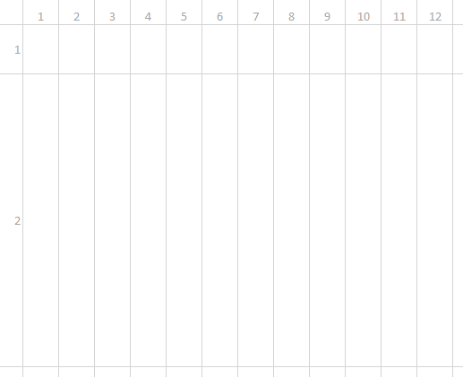

# PIGISTE pour Le Havre
> Le TP doit respecter les normes et les standards du WEB (ex. https://www.w3.org/ et https://checklists.opquast.com/fr/)  

## Mise en situation
La *Web agency* **"Orély"** vous a trouvé votre première mission à la ***Mairie du Havre***.  
Vous travaillez donc avec le redacteur en chef de la Mairie et vous devez l'aider à intégrer des élements sur la première page du site : **Il s'agit d'un recapitulatif des actualités de la ville du Havre datant d'octobre 2019**.  

  
  

## Structure du dossier
Le dossier de ce test sera composé de cette manière :
* index.html
* assets
    * img
        * images_du_site
    * css
        * style.css

## Contraintes du test
* Une feuille de style obligatoire ( *style.css* ) : **Pas de balise ou attribut style** dans votre page html.
* Les images principales se trouves dans le dossier du TP **img**.
* Utilisation de l'anglais lors de la création de vos **class** et de vos **id**.
* Un code **propre** avec une belle **indentation** pour plus de lisibilité.
* Utilisation d'un color picker pour les couleurs : ex. **Colorpick eyedropper** sous Chrome.
* Utilisation des unités suivantes :
    * ```rem``` : *padding, margin, text, size, px ...*  
    * ```vh, vw``` : *%, px ...*  
    * **Bon parfois, vous n'allez pas pouvoir faire autrement, le ```%``` sera permis :)**
    
* Utilisation de balise `````` et non de l'attribut ```background-image```
* Utilisation de "CSS GRID" : *Tutos sympas pour bien démarrrer*
    * https://developer.mozilla.org/fr/docs/Web/CSS/CSS_Grid_Layout
    * https://www.w3schools.com/css/css_grid.asp
    * https://css-tricks.com/snippets/css/complete-guide-grid/
* Partir d'une GRID de **12 colonnes** et de **2 rangées**.  

  

## A VOUS DE CODER !!
> L'agence **Orély** compte sur vous et promis, on vous embauche !
